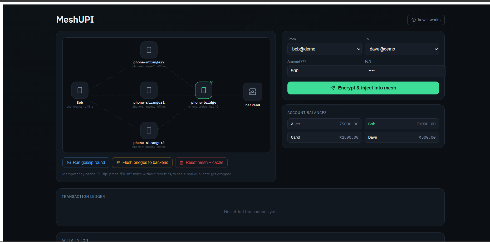
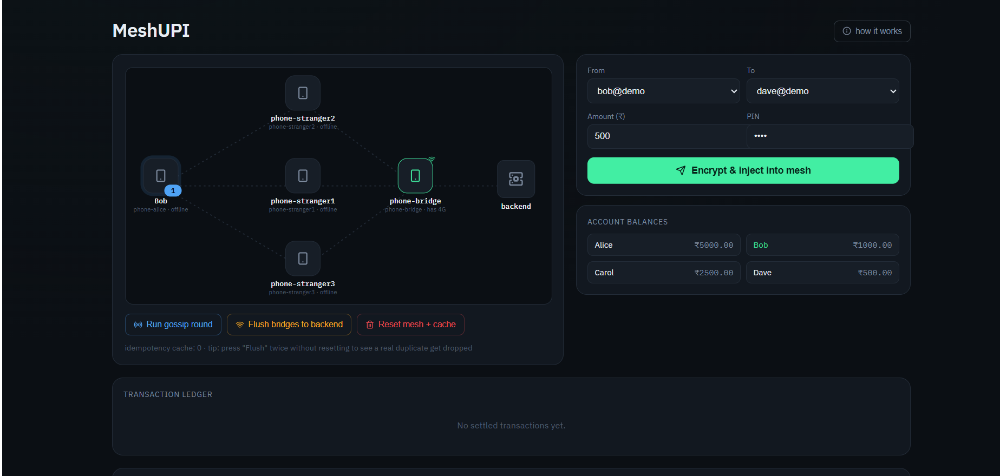
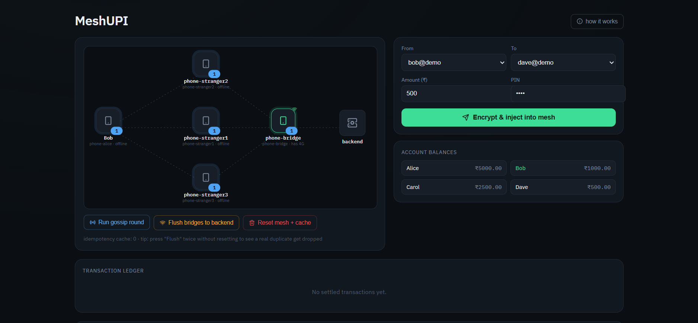
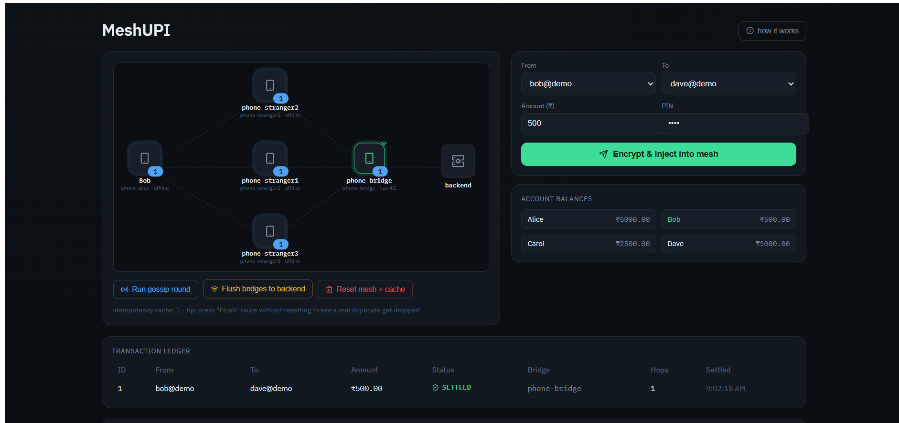
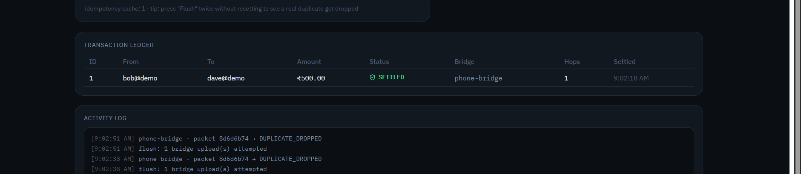

# MeshUPI

A secure offline UPI payment simulation system built using **Spring Boot** and **React**. The project demonstrates how UPI transactions can be performed without an active internet connection by storing payment requests locally and synchronizing them once connectivity is restored.

---

## Features
- Offline UPI payment simulation
- Local transaction storage
- Automatic synchronization of pending transactions
- Transaction history
- H2 in-memory database
- Responsive React frontend
- RESTful Spring Boot backend
- Duplicate transaction detection (idempotency)

---

## Tech Stack
| Component | Technology |
|-----------|------------|
| Programming Language | Java, JavaScript |
| Backend Framework | Spring Boot |
| Frontend | React.js |
| Build Tool | Maven |
| Database | H2 In-Memory Database |
| ORM | Spring Data JPA (Hibernate) |
| API Testing | Postman |

---

## Project Structure
```text
UPIMesh/
├── .mvn/                              
├── frontend/  
├── images                       
├── src/
│   └── main/
│       ├── java/
│       │   └── com/demo/upimesh/
│       │       ├── config/        
│       │       ├── controller/            
│       │       ├── crypto/           
│       │       ├── model/        
│       │       ├── service/           
│       │       └── UpiMeshApplication.java
│       │
│       └── resources/
│           ├── application.properties 
│           └── templates/            
│
├── .gitignore                       
├── mvnw                               
├── mvnw.cmd                          
├── pom.xml                           
├── README.md                                                 
```

---

## Installation

### Prerequisites

- Java 17 or above
- Node.js (v18+ recommended)
- Maven (or use the Maven Wrapper included)

---


### Clone the Repository

```bash
https://github.com/JeslynMathew/UPIMesh.git
cd UPIMesh
```

---

### Run the Backend

Using Maven Wrapper:

```bash
./mvnw spring-boot:run
```

or on Windows:

```bash
mvnw.cmd spring-boot:run
```

The backend runs at:

```
http://localhost:8080
```

---

### Run the Frontend

```bash
cd frontend
npm install
npm run dev
```

The frontend runs at:

```
http://localhost:5173
```

---

## Database

This project uses an **H2 in-memory database**.

H2 Console:

```
http://localhost:8080/h2-console
```

Default JDBC URL:

```
jdbc:h2:mem:upimesh
```

---


## Screenshots

### Home Page

---

### Payment Initiation

---

### Run Gossip

---

### Transaction Completed

---

### Handling Duplicate 

---

## Workflow

1. User initiates a payment.
2. Payment request is stored locally.
3. The application validates the request.
4. Pending transactions are maintained securely.
5. Once connectivity is available, pending transactions are synchronized.
6. Transaction history is updated.

---

